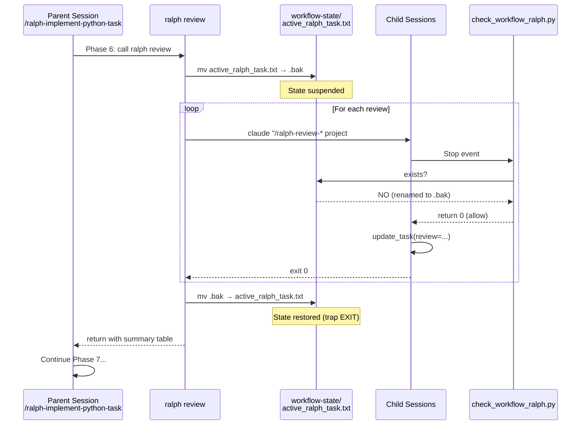
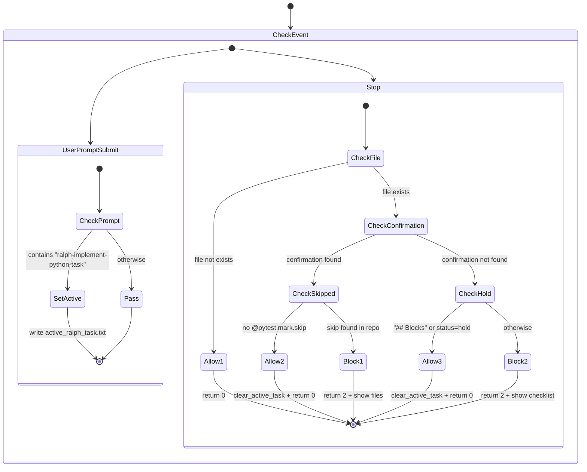

# Claude Code Configuration

This repository contains Claude Code configuration: commands, skills, and hooks.

## Structure

```
~/.claude/
├── commands/           # Slash commands (/command-name)
├── skills/             # User-defined skills
├── hooks/              # Workflow automation hooks
├── cli/                # Ralph Python CLI package
│   ├── ralph/          # Package modules
│   └── tests/          # pytest tests
├── .env                # Configuration (git-ignored)
└── .env.example        # Configuration template
```

## Ralph CLI

Python CLI for autonomous task execution with API recovery and Telegram notifications.

### Installation

```bash
cd ~/.claude/cli
pip install -e .
```

### Commands

```bash
# Interactive planning
ralph plan <project> <tasks...>
ralph plan myproject 1-4 6 8-10

# Autonomous implementation
ralph implement <project> <tasks...>
ralph implement myproject 1-4 6 8-10
ralph implement myproject 1-3 -w /path/to/project --max-budget 5

# Code reviews (isolated contexts)
ralph review <task_ref>
ralph review myproject#1

# API health check
ralph health
ralph health -v

# View and manage logs
ralph logs                          # List recent logs
ralph logs -t implement             # Filter by type
ralph logs view <file>              # View with highlighting
ralph logs view <file> --vim        # Open in vim
ralph logs tail <file>              # Real-time (tail -f)
ralph logs clean                    # Cleanup old logs
```

### Task Number Ranges

| Syntax | Expands to |
|--------|------------|
| `1-4` | `1 2 3 4` |
| `1-4 6 8-10` | `1 2 3 4 6 8 9 10` |

### Options

| Option | Description |
|--------|-------------|
| `-w, --working-dir` | Working directory for Claude |
| `--max-budget` | Maximum budget in USD per task |
| `--no-recovery` | Disable automatic recovery |

### Error Handling

The CLI automatically detects and handles failures:

| Error Type | Detection | Action |
|------------|-----------|--------|
| `CONTEXT_OVERFLOW` | `Prompt is too long` | Retry with fresh session (max 2) |
| `API_TIMEOUT` | `Tokens: 0 in / 0 out` | Recovery loop → Retry |
| `RATE_LIMIT` | `429` | Recovery loop → Retry |
| `OVERLOADED` | `529` | Recovery loop → Retry |
| `AUTH_EXPIRED` | `401` | Recovery loop → Retry |
| `FORBIDDEN` | `403` | Stop pipeline |

### Recovery Loop

When recoverable error detected:
1. **Wait 10 min** → Health check
2. **Wait 20 min** → Health check (if still failing)
3. **Wait 30 min** → Health check (if still failing)
4. **If all fail** → Stop pipeline, send Telegram alert

### Configuration

Create `~/.claude/.env`:

```bash
# Telegram notifications (optional)
TELEGRAM_BOT_TOKEN="123456789:ABCdefGHIjklMNOpqrsTUVwxyz"
TELEGRAM_CHAT_ID="-1001234567890"

# Recovery settings
RECOVERY_ENABLED=true
RECOVERY_DELAYS="600,1200,1800"  # 10, 20, 30 minutes
CONTEXT_OVERFLOW_MAX_RETRIES=2
```

### Cleanup Before Each Task

Before starting each task, uncommitted changes are cleaned:
```bash
git checkout -- .
git clean -fd
```

This ensures each task starts with a clean codebase.

## Commands

### Task Execution

| Command | Description |
|---------|-------------|
| `/execute-python-task` | Full workflow: planning → approval → implementation → testing |
| `/ralph-plan-task project#N` | Planning only with human interaction (universal) |
| `/ralph-implement-python-task project#N` | Autonomous implementation (requires plan) |
| `/ralph-batch-check project#1 project#2...` | Run full test suite after batch, fix indirect issues |

### Reviews

| Command | Description |
|---------|-------------|
| `/ralph-review-code project#N` | 5 code review agents in parallel, saves to task |
| `/ralph-review-simplify project#N` | Code simplifier, saves to task |
| `/ralph-review-security project#N` | Security review, saves to task |
| `/ralph-review-codex project#N` | Codex review, saves to task |
| `/python-linters` | Run ruff and djlint on codebase |

### Reviews (direct, not recommended)

| Command | Description |
|---------|-------------|
| `/pr-review-toolkit:review-pr` | Comprehensive PR review (use Task tool for isolation) |
| `/security-review` | Security audit (use Task tool for isolation) |
| `/codex-review project#N` | Code review via Codex CLI (use Task tool for isolation) |

### Task Management

| Command | Description |
|---------|-------------|
| `/create-tasks` | Create tasks in md-task-mcp from requirements |
| `/memorize-task` | Update memory with task summary |

## Hooks

### check_workflow.py

Controls `/execute-python-task` workflow:
- Blocks stop until Claude confirms: `I confirm that all task phases are fully completed.`
- Returns checklist if not confirmed
- Allows "need feedback" bypass for user interaction

### check_workflow_ralph.py

Controls `/ralph-implement-python-task` autonomous workflow:
- Blocks stop until Claude confirms: `I confirm that all task phases are fully completed.`
- Returns checklist if not confirmed
- Allows stop on hold (`## Blocks` + `status=hold`)
- No "need feedback" bypass (autonomous mode)

### enforce_isolated_skills.py

Blocks direct Skill calls for tools that must run in isolated context:
- `pr-review-toolkit:review-pr` → must use Task tool
- `code-simplifier:code-simplifier` → must use Task tool
- `security-review` → must use Task tool
- `codex-review` → must use Task tool

These skills consume too much context when run directly, causing context overflow.

### hook_utils.py

Common logging utilities for all hooks:
```python
from hook_utils import get_logger
log = get_logger("my_hook")
log("EVENT", "message")
```

Writes to: `~/.claude/logs/hooks/{hook_name}.log`

### notify.sh

Desktop notifications for:
- Agent task completion
- User attention needed

## Logging

All logs are stored in `~/.claude/logs/`:

```
~/.claude/logs/
├── ralph-implement/          # Implementation sessions
│   ├── session_*.log         # Session summary
│   ├── {project}_{N}_*.log   # Per-task output
│   └── batch_check_*.log     # Batch check output
├── ralph-plan/               # Planning sessions
│   ├── session_*.log         # Session summary
│   └── {project}_{N}_*.log   # Per-task output
├── reviews/                  # Review sessions
│   └── {project}_{N}_{review}_*.log
└── hooks/                    # Hook events
    ├── check_workflow.log
    ├── check_workflow_ralph.log
    └── enforce_isolated_skills.log
```

### Log Format

**CLI**: Full Claude output with timestamps and headers.

**Hooks**: `[YYYY-MM-DD HH:MM:SS] EVENT: message`
- `WORKFLOW_START` / `WORKFLOW_CONFIRMED` / `WORKFLOW_HOLD`
- `BLOCKED` / `ALLOWED`
- `NEED_FEEDBACK`
- `ERROR`

## Testing Requirements

All workflows require comprehensive testing:

| Type | Description |
|------|-------------|
| **Unit tests** | Functions, methods, edge cases |
| **API tests** | Endpoints, response codes, auth |
| **UI tests** | Playwright for frontend flows |
| **Edge cases** | Empty data, boundaries, errors |

## Workflow Phases

### execute-python-task (0-12)

```
0. Get Task
1. Plan Mode (EnterPlanMode → analysis → ExitPlanMode) ← STOP for approval
2. Update Task (status=work)
3. Implementation
4. Initial Testing
5. Code Review (/pr-review-toolkit:review-pr)
6. Security Review (/security-review)
7. Codex Review (/codex-review)
8. Final Testing
9. Linters (/python-linters)
10. Cleanup (garbage files, permissions)
11. Documentation
12. Complete (report, user confirmation) ← STOP for approval
```

### ralph-implement-python-task (0-11)

```
0. Validate Task (check ## Plan exists)
1. Update Task (status=work, skip if already work)
2. Read Plan Context (files from Scope)
3. Implementation
4. Initial Testing (with data-testid for UI tests)
5. UI Review (visual analysis with Opus + playwright)
6. Reviews (ralph review — isolated contexts)
7. Final Testing (+ final UI check)
8. Linters
9. Cleanup
10. Documentation
11. Complete (auto commit, report to task, status=done)
```

**Key difference**: Ralph is fully autonomous - no stops, auto-commits, blocks+hold on problems.

**Reviews (Phase 6)** run in isolated sessions via `ralph review`:
- `/ralph-review-code` — 5 agents in parallel
- `/ralph-review-simplify` — code-simplifier
- `/ralph-review-security` — security review
- `/ralph-review-codex` — Codex review

## Ralph Workflow Architecture

**Daily cycle:** Evening planning → Overnight implementation → Morning review

```
┌─────────────────────────────────────────────────────────────────────┐
│                         RALPH WORKFLOW                               │
├─────────────────────────────────────────────────────────────────────┤
│                                                                      │
│  ┌──────────────┐     ┌──────────────┐     ┌──────────────────────┐ │
│  │ md-task-mcp  │────▶│   Tasks DB   │◀────│ Task State Machine   │ │
│  └──────────────┘     └──────────────┘     │ backlog→work→done    │ │
│                                             │         ↓            │ │
│                                             │       hold           │ │
│                                             └──────────────────────┘ │
├─────────────────────────────────────────────────────────────────────┤
│  PLANNING PHASE (Interactive)                                        │
│  ┌────────────────┐    ┌─────────────────────┐                      │
│  │  ralph plan    │───▶│ /ralph-plan-task    │                      │
│  │  (Python CLI)  │    │ EnterPlanMode       │◀──▶ Human           │
│  └────────────────┘    │ AskUserQuestion     │     Feedback         │
│                        │ ExitPlanMode        │                      │
│                        └─────────────────────┘                      │
│                                 │                                    │
│                                 ▼                                    │
│                        ┌─────────────────────┐                      │
│                        │  Task += ## Plan    │                      │
│                        │  status = work      │                      │
│                        └─────────────────────┘                      │
├─────────────────────────────────────────────────────────────────────┤
│  IMPLEMENTATION PHASE (Autonomous)                                   │
│  ┌──────────────────┐  ┌───────────────────────────┐                │
│  │ ralph implement  │─▶│/ralph-implement-python-task│               │
│  │ (Python CLI)     │  │ NO AskUserQuestion        │                │
│  │ --dangerously-   │  │ NO "need feedback"        │                │
│  │   skip-permissions│ │ Auto-commit on success    │                │
│  └──────────────────┘  └───────────────────────────┘                │
│           │                       │                                  │
│           │            ┌──────────┴──────────┐                      │
│           │            ▼                     ▼                      │
│           │    ┌─────────────┐       ┌─────────────┐                │
│           │    │   SUCCESS   │       │   BLOCKED   │                │
│           │    │ status=done │       │ WIP commit  │                │
│           │    │ + commit    │       │ status=hold │                │
│           │    └─────────────┘       │ + ## Blocks │                │
│           │                          └─────────────┘                │
│           ▼                                                          │
│  ┌────────────────────────────────────────────┐                     │
│  │         check_workflow_ralph.py            │                     │
│  │  Hook: UserPromptSubmit → track task       │                     │
│  │  Hook: Stop → require confirmation OR hold │                     │
│  └────────────────────────────────────────────┘                     │
├─────────────────────────────────────────────────────────────────────┤
│  BATCH CHECK PHASE (after all tasks)                                 │
│  ┌──────────────────┐  ┌───────────────────────────┐                │
│  │ ralph implement  │─▶│  /ralph-batch-check       │                │
│  │ (auto after loop)│  │  - Full test suite        │                │
│  └──────────────────┘  │  - Fix indirect issues    │                │
│                        │  - Create check task      │                │
│                        └───────────────────────────┘                │
└─────────────────────────────────────────────────────────────────────┘
```

## Reviews Isolation (ralph review)

Reviews run in isolated Claude sessions to prevent context overflow. The workflow state is suspended for child sessions.



### Hook State Machine



### ralph review Output

```
════════════════════════════════════════════════════════════════════════════════
  SUMMARY
════════════════════════════════════════════════════════════════════════════════
✓ All 4/4 reviews completed successfully!

┌────────────────────────┬──────────────┬───────┬─────────────┐
│         Review         │    Status    │ Time  │  Log Size   │
├────────────────────────┼──────────────┼───────┼─────────────┤
│ Code Review (5 agents) │ ✅ Completed │ 03:41 │      9 KB   │
├────────────────────────┼──────────────┼───────┼─────────────┤
│ Code Simplifier        │ ✅ Completed │ 01:56 │      2 KB   │
├────────────────────────┼──────────────┼───────┼─────────────┤
│ Security Review        │ ✅ Completed │ 01:44 │      2 KB   │
├────────────────────────┼──────────────┼───────┼─────────────┤
│ Codex Review           │ ✅ Completed │ 03:49 │      4 KB   │
└────────────────────────┴──────────────┴───────┴─────────────┘

Log files:
  Code Review (5 agents): ~/.claude/logs/reviews/project_N_ralph-review-code_*.log
  Code Simplifier: ~/.claude/logs/reviews/project_N_ralph-review-simplify_*.log
  Security Review: ~/.claude/logs/reviews/project_N_ralph-review-security_*.log
  Codex Review: ~/.claude/logs/reviews/project_N_ralph-review-codex_*.log
```

## Task Statuses (md-task-mcp)

| Status | Meaning |
|--------|---------|
| `backlog` | Not started |
| `work` | In progress |
| `done` | Implementation complete, awaiting review |
| `human approved` | Verified by human |
| `hold` | Blocked, needs human intervention |

## Blocks Pattern

When autonomous workflow encounters a problem:

```bash
# 1. Save current work
git add -A
git commit -m "WIP: project#N - blocked: brief description"
```

```python
# 2. Record block in task
update_task(
    project="project",
    number=N,
    status="hold",
    body=existing_body + """
## Blocks
- [2025-01-07 12:00] Problem description
  - Attempted: what was tried
  - Failed because: reason
  - Need from human: specific request
  - WIP commit: abc1234
"""
)
```

Then EXIT immediately. WIP commit ensures next task in loop starts clean.
